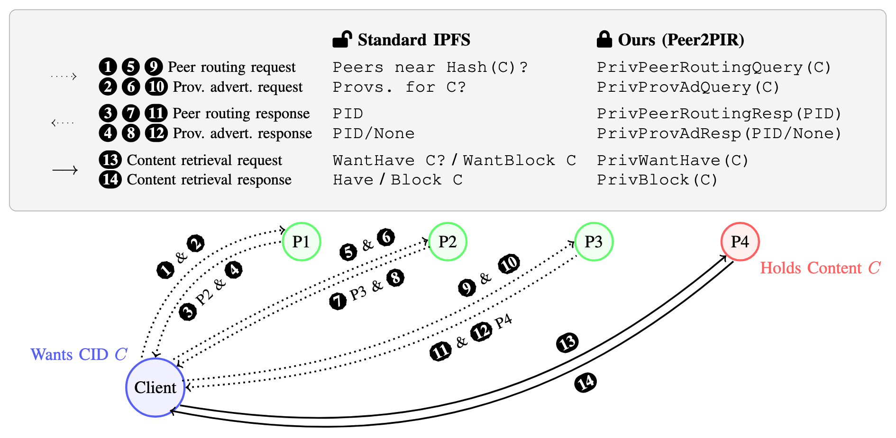

# Peer2PIR: Private Queries for IPFS

This repository contains the code for the paper ["Peer2PIR: Private Queries for IFPS"](https://arxiv.org/abs/2405.17307) by Miti Mazmudar, Shannon Veitch, and Rasoul Akhavan Mahdavi.

## Private steps of IPFS queries
The following diagram the three main steps in an IPFS query:
* Peer Discovery
* Content Discovery
* Content Retrieval

<!-- Set the width to be 50% of the text width -->

  

## Contributors
- Miti Mazmudar
- Shannon Veitch
- Rasoul Akhavan Mahdavi

## Acknowledgments
This work was generously supported by a research grant (RFP-014) from Protocol Labs.